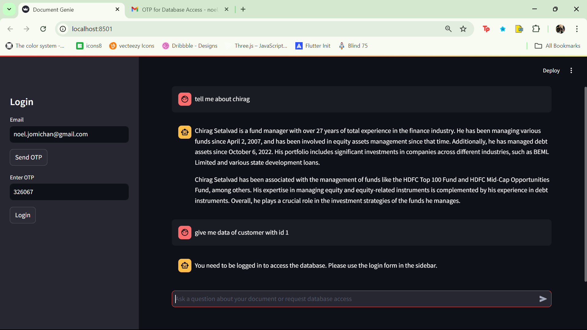
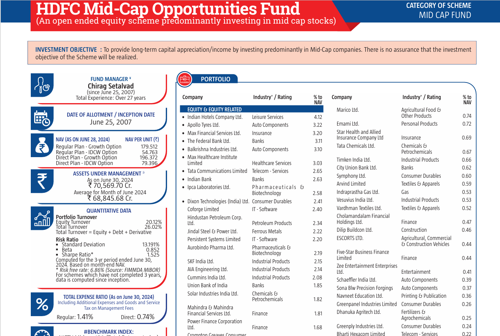

# Document Genie

Document Genie is an intelligent chat interface that allows users to query both document content and a customer database. It features secure authentication and provides responses based on the user's access level and query type.


## Features

- **Document Querying**: Ask questions about loaded documents, such as details about fund managers or investment funds.
- **Database Access**: Authenticated users can retrieve customer information from the database.
- **Secure Authentication**: Email-based OTP (One-Time Password) for user authentication.
- **Intelligent Query Processing**: Distinguishes between document-related queries and database access requests.
- **Responsive UI**: Dark-themed, user-friendly interface with clear separation between user inputs and system responses.

## Usage Examples

### Document Queries


### Database Queries




### Investment Fund Information



### Market Index Information


## Setup and Installation

1. Clone the repository:
   ```
   git clone https://github.com/NoelJomichan/document_genie.git
   cd document-genie
   ```

2. Create a virtual environment (optional but recommended):
   ```
   python -m venv venv
   source venv/bin/activate  # On Windows, use `venv\Scripts\activate`
   ```

3. Install the required packages:
   ```
   pip install -r requirements.txt
   ```

4. Set up your environment variables:
   Create a `.streamlit/secrets.toml` file with your API keys:
   ```
   OPENAI_API_KEY = "your_openai_api_key"
   EMAIL_PASSWORD = "your_email_password"
   LLAMA_API_KEY = "your_llama_api_key"
   ```

5. Run the Streamlit app:
   ```
   streamlit run app.py
   ```

6. Open your web browser and go to `http://localhost:8501` to use the app.

## Security

- Email-based OTP for user authentication
- Database access restricted to authenticated users
- Sensitive information protected behind authorization

## Technical Stack

- Streamlit for the web interface
- OpenAI's language models for natural language processing
- FAISS for efficient similarity search in document querying
- Email-based OTP system for secure authentication

## Contributing

Contributions are welcome! Please feel free to submit a Pull Request.

## License

This project is licensed under the MIT License - see the [LICENSE](LICENSE) file for details.